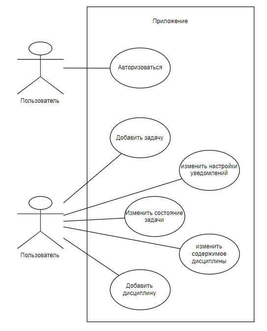
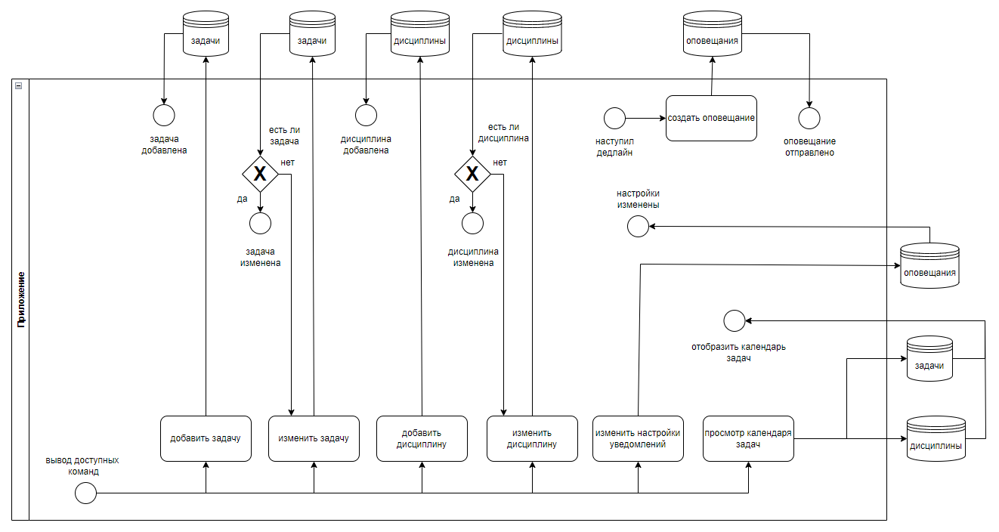
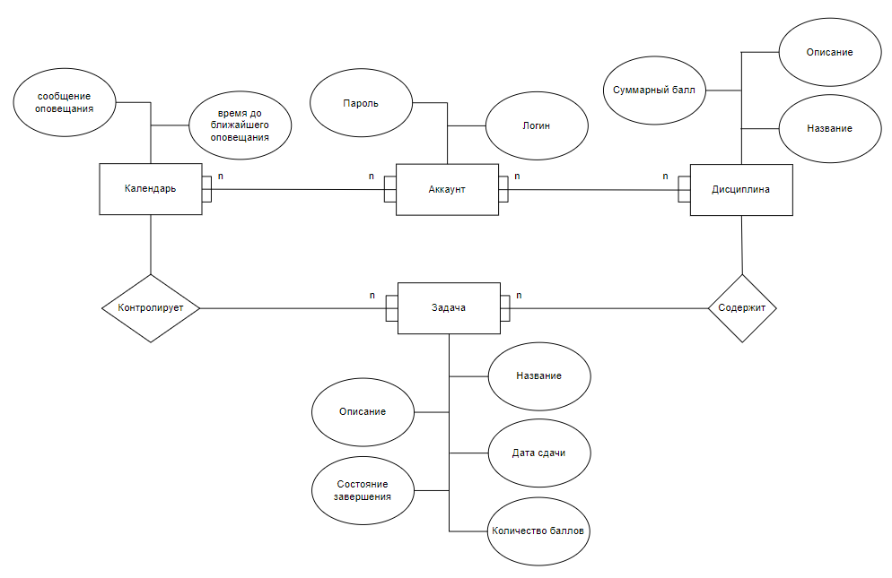
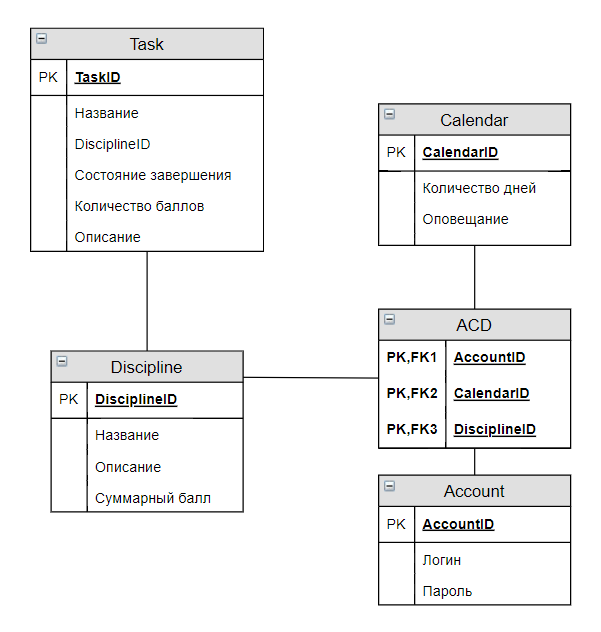
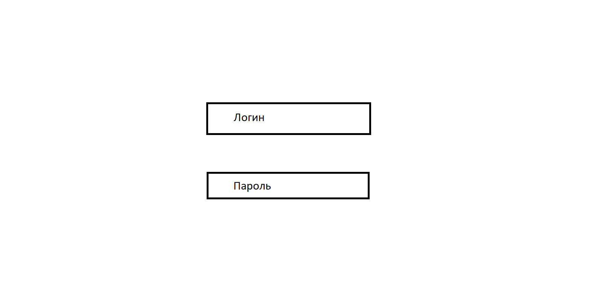
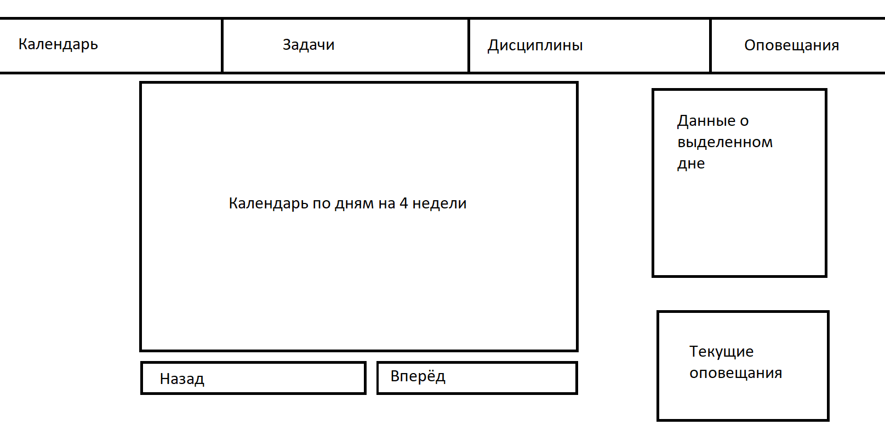
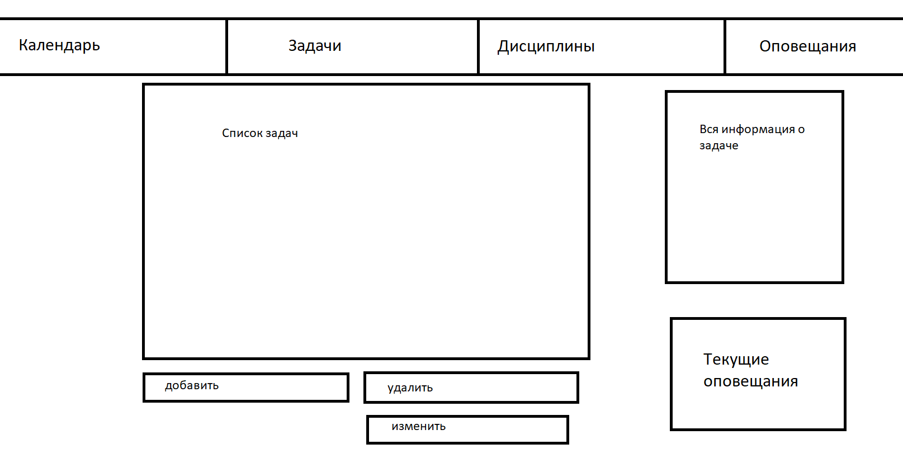
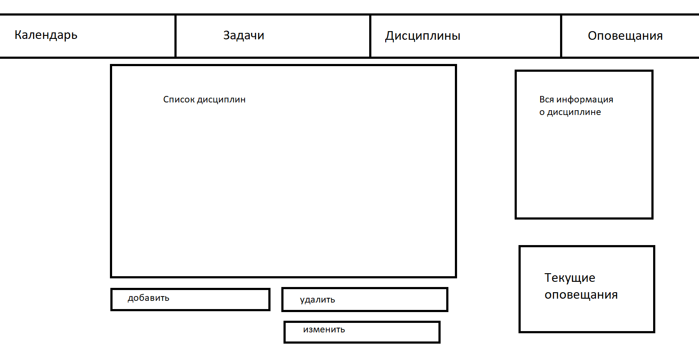
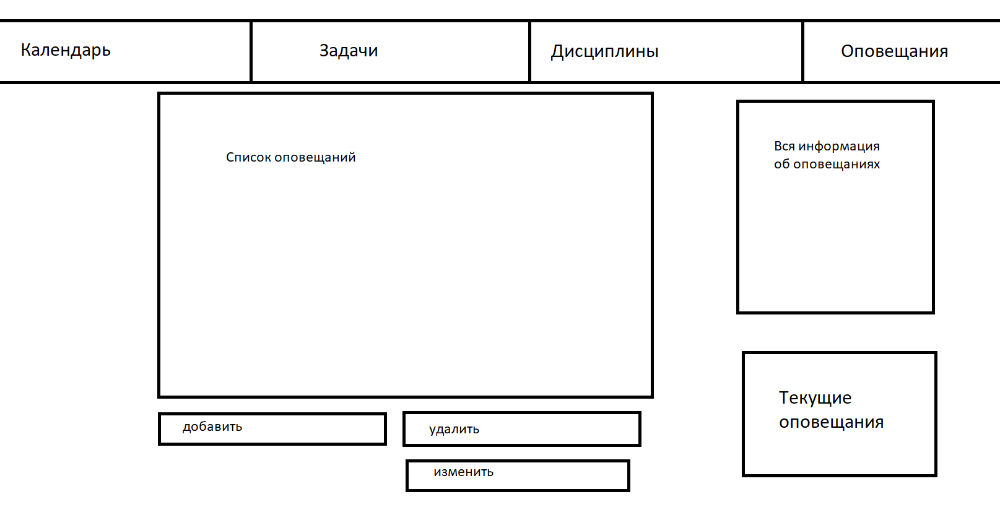

# Лабораторная работа №1

## a. Цель работы, решаемая проблема/предоставляемая возможность

Название: ToDo список для университета

### Краткое описание идеи проекта

Приложение для учёта прогресса и сроков по домашним заданиям, лабораторным работам, курсовым проектам и т.д. 

## b. Краткий перечень функциональных требований

Пользователь будет иметь возможность указывать сроки, прогресс выполнения и новые курсы, по которым необходимо вести учёт.

## c. Use-case диаграмма системы

## d. BPMN диаграмма основных бизнес-процессов

## e. Примеры описания основных пользовательских сценариев

Пользователь после запуска приложения может:

- добавить задачу
- изменить настройки уведомлений
- изменить состояние задачи
- изменить содержимое дисциплины
- добавить дисциплину
- посмотреть сведения о текущих задачах
- удалить задачу
- удалить дисциплину

## f. ER-диаграмма сущностей

## g. Диаграмма БД

## h. Компонентная диаграмма системы

## Эскизы

Страница авторизации:

Страница календаря:

Страница задач:

Страница дисциплин:

Страница оповещаний:

